# Aplikacioni per ngarkimin e fajllave ne Google Drive 

Qellimi kryesor i aplikacionit qe e krijuam ne eshte qe perdoruesit te ia mundesoj qe fajllat me ekstension .doc, .docx, .xls, .xlsx t’i ngarkoj ne nje folder te caktuar  ne Google Drive. Aplikacionin e kemi zhvilluar si GUI (graphical user interface) duke perdorur vetem modulin tkinter te Python. Ky aplikacion permban nje menubar me funksionalitetet perkatese te saj .Menubar permban filemenu e cila ka dy komanda Upload dhe Exit  dhe helpmenu e cila ka komanden help .

# 1. Teknologjitë e përdorura

       Editori: PyCharm IDE
       Gjuha programuese: Python 
       Sistemi Operativ: Windows

# 2.Instalimi i package qe nevojiten per zhvillimin e aplikacionit

Si fillim per te zhvilluar kete aplikacion ne kemi instaluar keto package:

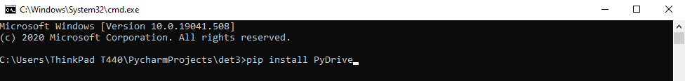
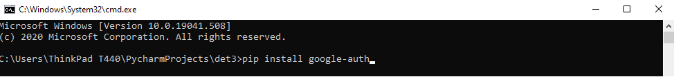
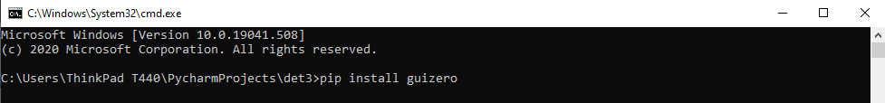
# 3.Ekzekutimi i Aplikacionit
Ekzekutimi mund të bëhet duke e bërë run projektin në njërin nga editor-ët, në rastin e mëposhtëm është përdorur PyCharm:

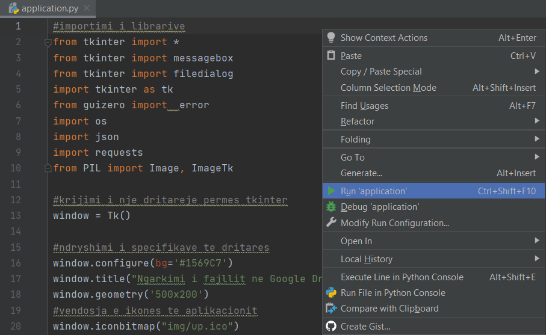

Programi mund të ekzekutohet edhe duke hapur terminalin ne direktotriumin e projektit dhe duke shkruajtur komandën si në vijim:

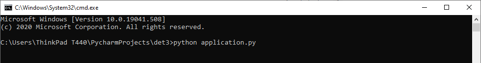

# 4.Testimet

Pas ekzekutimit te aplikacionit do te na shfaqet dritarja e krijuar dhe meny-ja e saj .
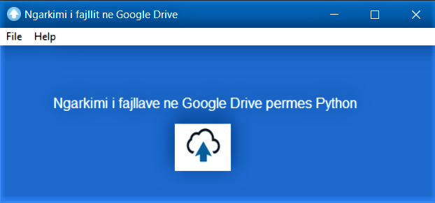
 
Ne momentin qe klikojm ne file menu do na shfaqen dy opsionet e saj Upload dhe Exit
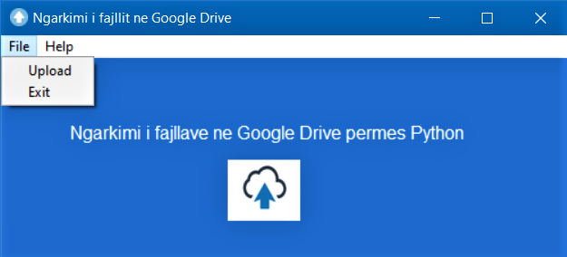

Kur zgjedhim opsionin Upload shfaqen dy fusha te cilat perdoruesi duhet t’i plotesoj.Ne fushen e pare duhet te vendos access tokenin per qasjen ne Google Drive dhe ne fushen e dyte folderin specifik ku deshiron ta ruaj fajllin qe e zgjedh.
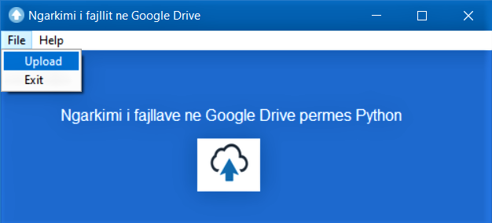
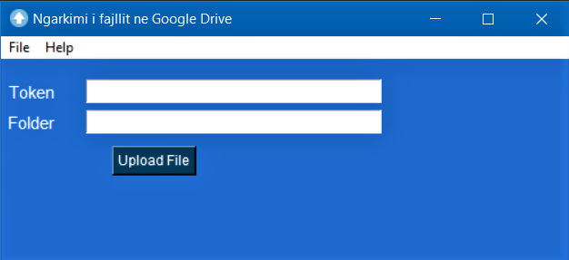

Per te marre access tokenin e Google Drive .Perdoruesi duhet te hap linkun https://developers.google.com/oauthplayground/  te selektoj Drive APIv3 dhe te autorizoj API-ne.
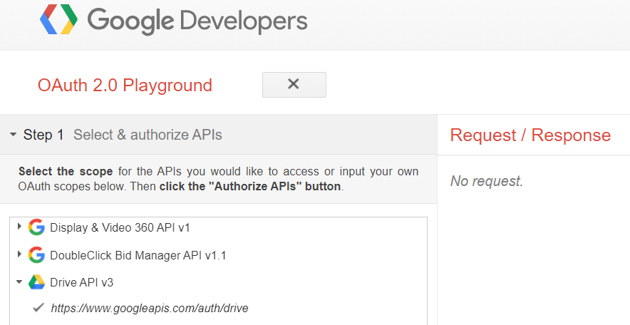

Perdoruesi pas aplikimit te ketyre hapave pranon access tokenin e tij i cili do te vlej per nje kohe te caktuar nga google .

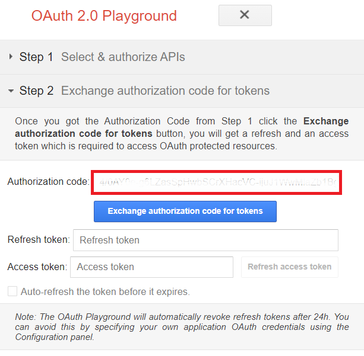

 Per te shenuar folderin ne te cilin perdoruesi deshiron ta ruaj fajllin e zgjedhur duhet qe te merr ID-ne perkatese te atij folderi .

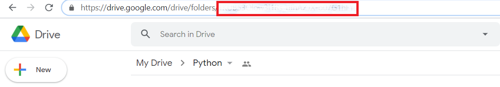

Kur perdoruesi shtyp butonin Upload nese te dhenat e shenuara nuk jane valide 
shfaqet ky mesazh :
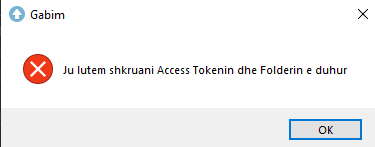

Ndersa nese access token dhe ID e folderit jane valide atehere perdoruesit i shfaqet kerkesa per ta zgjedhur fajllin e percaktuar .(Perdoruesi mund te zgjedh vetem fajllat te cilet kane ekstension .doc, .docx, .xls, .xlsx .  )
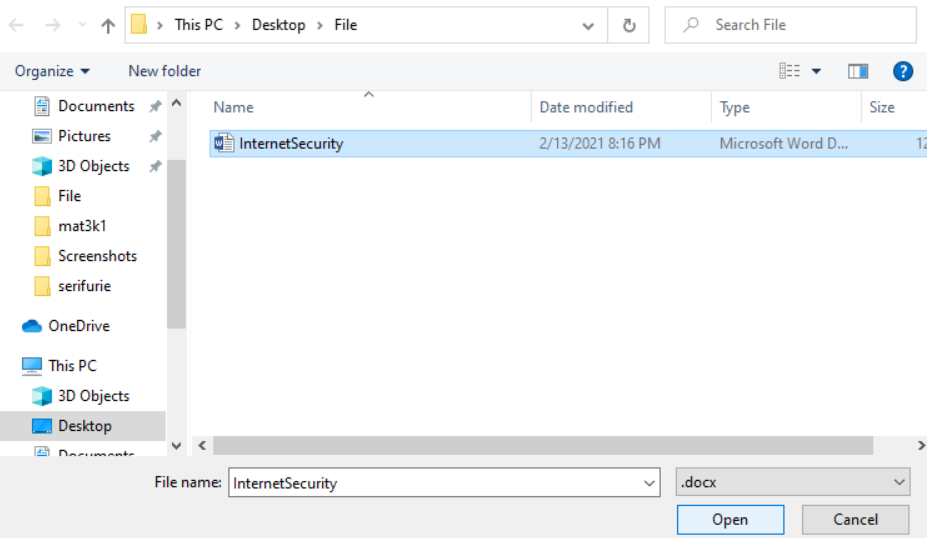

Pas zgjedhjes se fajllit perdoruesit i shfaqet mesazhi se dokumenti u ruajt me sukses.

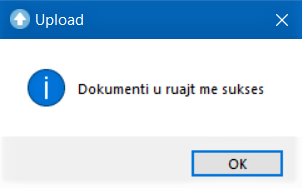

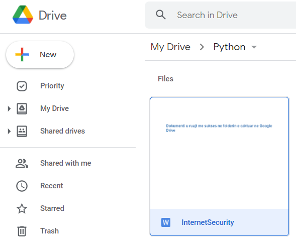

Nese perdoruesi zgjedh help meny-ne i shfaqet opsioni Help i saj .
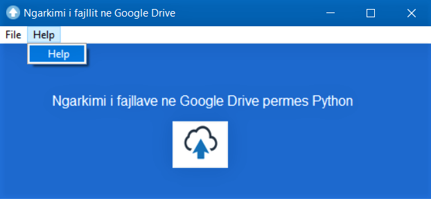

Pas zgjedhjes se opsionit Help perdoruesit i shfaqet  nje mesazh informacioni rreth perdorimit te aplikacionit.
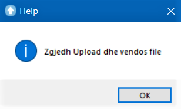

Nese perdoruesi deshiron ta mbyll aplikacionin atehere ai mund te zgjedh opsionin Exit te file menys-se .
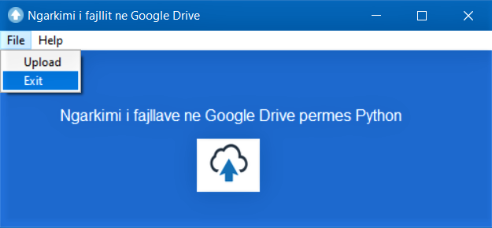

Pas shtypjes se opsionit Exit perdoruesit do i shfaqet mesazhi qe ka zgjedhur te mbyll aplikacionin dhe aplikacioni do mbyllet .
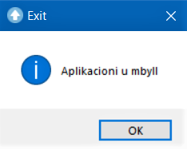
